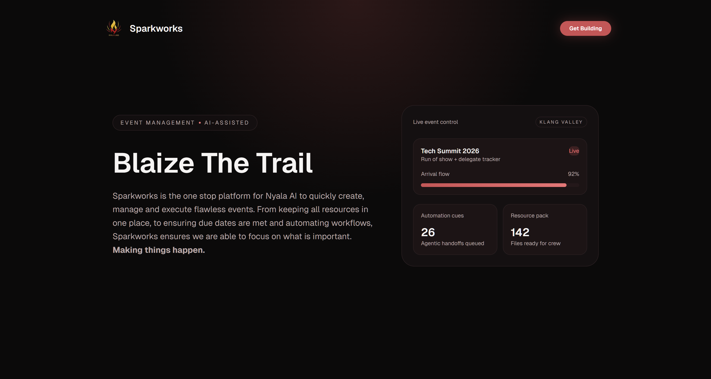

# Sparkworks 🔥

**Blaize the Trail** - A powerful, AI-assisted event management platform designed to organize, coordinate, and execute flawless events.



## 📖 Overview

Sparkworks is a comprehensive event management system built for the Nyala AI team. It provides a centralized hub for event creation, resource management, multi-stage approval workflows, and timeline tracking. Whether you're organizing a workshop, hackathon, talk, or any type of event, Sparkworks keeps everything organized and ensures deadlines are met.

### Key Features

- **Event Creation & Management** - Create and manage events with customizable metadata
- **Multi-Stage Approval Workflows** - Define complex approval processes with department-based reviews
- **Resource Organization** - Link and organize documents, sheets, slides, and folders for each event
- **Status Tracking** - Visual timeline of event progression from ideation to completion
- **Team Collaboration** - Built-in people search and approval assignment
- **Authentication** - Secure OAuth integration with Google via Supabase
- **Type-Safe API** - Open RPC (ORPC) for fully type-safe client-server communication

---

## 🏗️ Project Structure

```
sparkworks/
├── app/                          # Next.js App Router
│   ├── layout.tsx               # Root layout with metadata
│   ├── globals.css              # Global Tailwind styles and theme tokens
│   ├── page.tsx                 # Landing page (public)
│   ├── auth/
│   │   └── callback/route.ts    # Google OAuth callback handler
│   ├── dashboard/               # Protected dashboard routes
│   │   ├── layout.tsx           # Dashboard wrapper with sidebar
│   │   ├── page.tsx             # Main dashboard overview
│   │   └── events/
│   │       ├── page.tsx         # Events list with create dialog
│   │       └── [slug]/
│   │           ├── page.tsx     # Event details & management
│   │           └── ideation/    # Event ideation/planning phase
│   └── rpc/
│       └── [[...rest]]/route.ts # Universal ORPC API endpoint
│
├── components/                   # Reusable React components
│   ├── Header.tsx               # Page header
│   ├── SignInBtn.tsx            # Authentication button
│   ├── Dialog.tsx               # Modal/dialog wrapper
│   ├── ResourceCard.tsx         # Resource display component
│   ├── PeopleSearch.tsx         # User search for approvals
│   ├── SidebarLinks.tsx         # Navigation sidebar
│   └── Event/                   # Event-specific components
│       ├── NewEventForm.tsx     # Create event form
│       ├── AllEvents.tsx        # Event grid/list view
│       ├── SingleEvent.tsx      # Event details page
│       ├── IdeationEvent.tsx    # Ideation phase interface
│       ├── ApproveEventForm.tsx # Approval review interface
│       └── Skeletons/           # Loading placeholders
│
├── db/                           # Database layer (Drizzle ORM)
│   ├── drizzle.ts               # Drizzle client initialization
│   └── schema/
│       ├── events.ts            # Event and event_resources tables
│       ├── approvedUsers.ts      # Users and departments tables
│       ├── event.types.ts        # TypeScript type exports
│       ├── event.relations.ts    # ORM relationship definitions
│       └── helper.ts            # Shared utilities (timestamps, etc)
│
├── data/                         # API layer (ORPC)
│   ├── index.ts                 # Router exports
│   ├── base.ts                  # Base implementation & contracts
│   ├── os.ts                    # ORPC server with auth middleware
│   ├── contracts/               # ORPC input/output contracts
│   │   ├── index.ts
│   │   └── event.ts
│   ├── callables/               # Read-only procedures
│   │   └── events/
│   │       ├── GetEvents.ts
│   │       ├── GetEvent.ts
│   │       ├── GetStatuses.ts
│   │       ├── GetPeopleApprovalList.ts
│   │       └── GetReviewersList.ts
│   └── actions/                 # Write/mutation procedures
│       └── events/
│           ├── CreateEventAction.ts
│           ├── StateChangeAction.ts
│           ├── ApproveStateChangeAction.ts
│           ├── ArchiveEventAction.ts
│           └── DeleteEventAction.ts
│
├── libs/                         # Utility libraries
│   ├── orpc.ts                  # ORPC client configuration
│   ├── auth-middleware.ts       # Authentication middleware
│   ├── utils.tsx                # General utilities
│   ├── supabase/                # Supabase clients
│   │   ├── server.ts           # Server-side client
│   │   ├── client.ts           # Browser-side client
│   │   └── proxy.ts            # Proxy utilities
│   ├── google/                  # Google API integration
│   │   ├── client.ts           # Google API client
│   │   └── helper.ts           # Integration helpers
│   └── schema/
│       └── event.schema.ts     # Zod validation schemas
│
├── public/                       # Static assets
│   ├── Logo.png
│   └── Other SVGs
│
├── Configuration & Setup Files
├── package.json                  # Dependencies and scripts
├── tsconfig.json                # TypeScript configuration
├── next.config.ts              # Next.js configuration
├── drizzle.config.ts           # Drizzle ORM configuration
├── postcss.config.mjs          # PostCSS for Tailwind
├── eslint.config.mjs           # ESLint rules
├── .env                        # Environment variables (not committed)
├── .env.example                # Environment template
├── .gitignore
├── bun.lock                    # Bun dependency lock
├── migrations/                 # Database migrations (auto-generated)
└── README.md
```

---

## 🛠️ Technology Stack

### Frontend
- **Next.js 16.1.6** - React 19.2.3 with App Router for modern SSR
- **TypeScript** - Strict mode enabled for type safety
- **Tailwind CSS v4** - Utility-first CSS framework
- **DaisyUI 5.5.18** - Component library with dark theme support
- **Lucide React** - Beautiful icon library

### Backend & API
- **ORPC (Open RPC) 1.13.5** - Type-safe RPC framework
  - `@orpc/server` - Server-side procedures
  - `@orpc/client` - Client-side consumer
  - `@orpc/contract` - Type-safe input/output contracts
  - `@orpc/react` - React hooks for API calls
- **Node.js Runtime** - Server-side execution

### Database
- **PostgreSQL** - Primary relational database
- **Drizzle ORM 0.45.1** - Type-safe database queries
- **Drizzle-kit 0.31.9** - Schema management and migrations
- **Neon HTTP Client** - Serverless PostgreSQL via HTTP

### Authentication & Services
- **Supabase** - Authentication provider
  - `@supabase/ssr` - Server-side rendering support
  - Google OAuth integration
- **Google APIs** - Calendar and workspace integration
- **Gmail API** - Email capabilities (optional)

### Build & Quality Tools
- **Bun** - Fast JavaScript package manager (preferred)
- **npm** - Fallback package manager
- **ESLint 9** - Code quality linting
- **TypeScript 5** - Type checking

### Utilities
- `slugify` (1.6.6) - URL-friendly slug generation
- `clsx` (2.1.1) - Conditional className builder
- `tailwind-merge` (3.4.1) - Smart Tailwind class merging
- `zod` (4.3.6) - Runtime schema validation
- `dotenv` (17.3.1) - Environment variable loading

---

## 📦 Environment Variables

Create a `.env` file based on `.env.example` with the following variables:

| Variable | Type | Description |
|----------|------|-------------|
| `DATABASE_URL` | String | PostgreSQL connection string (Neon) |
| `NEXT_PUBLIC_SUPABASE_URL` | String | Supabase project URL |
| `NEXT_PUBLIC_SUPABASE_PUBLISHABLE_KEY` | String | Public Supabase key for client auth |
| `NEXT_PUBLIC_GOOGLE_CLIENT_ID` | String | Google OAuth Client ID |
| `GOOGLE_CLIENT_SECRET` | String | Google OAuth Client Secret (keep private) |
| `GOOGLE_REDIRECT_URI` | String | OAuth callback URL |
| `ROOT_FOLDER_DRIVE` | String | Google Drive folder ID for documents |
| `EVENT_PROPOSAL_TEMPLATE_ID` | String | Google Docs template for proposals |
| `RESEND_API_KEY` | String | Email service API key (optional) |
| `SUPABASE_PASSWORD` | String | Database admin password (dev only) |

**Setup Instructions:**

1. Copy `.env.example` to `.env`
2. Set up a Supabase project at https://supabase.com
3. Create a PostgreSQL database (use Neon for serverless)
4. Create Google OAuth credentials in Google Cloud Console
5. Fill in all required variables in `.env`
6. Never commit `.env` to version control

---

## 🚀 Getting Started

### Prerequisites
- **Node.js 18+** or **Bun 1.3+**
- **PostgreSQL** database (Neon recommended)
- **Supabase** account for authentication
- **Google Cloud** account for OAuth

### Installation

```bash
# Install dependencies with Bun (recommended)
bun install

# Or use npm
npm install
```

### Development

```bash
# Start the development server (http://localhost:3000)
bun run dev
# or
npm run dev
```

The application will be available at `http://localhost:3000` with hot module reloading.

### Building

```bash
# Create optimized production build
bun run build

# Start production server
bun run start
```

### Code Quality

```bash
# Run ESLint
bun run lint
# or
npm run lint

# Fix linting issues automatically
npm run lint -- --fix

# Type check with TypeScript
npx tsc -p tsconfig.json --noEmit
```

---

## 📊 Database Schema

### Core Tables

#### `approved_users`
Users with access to the system.
- `id` (PK) - Unique identifier
- `supabase_id` (UUID) - Supabase auth ID
- `email` (unique) - User email address
- `name` - Display name
- `profile` - Avatar URL
- `claimed` - Account activation status
- `created_at`, `updated_at`, `deleted_at` - Timestamps

#### `departments`
Organizational departments for approval workflows.
- `id` (PK)
- `name` (unique) - Department name
- `lead_id` (FK) - Department lead
- Timestamps

#### `events`
Main event records.
- `id` (PK)
- `title` - Event name
- `description` - Event details
- `slug` (unique) - URL-friendly identifier
- `event_type` - enum: `workshop`, `talk`, `hackathon`, `series`, `others`
- `current_status_id` (FK) - Current workflow stage
- `created_by_id` (FK) - Event creator
- Timestamps

#### `event_statuses`
Workflow stages for events.
- `id` (PK)
- `name` (unique) - Status name
- `order_index` - Display order
- **Values**: `ideation`, `prototype`, `production`, `pre-event`, `event`, `post-event`

#### `event_resources`
Documents and links associated with events.
- `id` (PK)
- `name` - Resource name
- `url` - Resource URL
- `type` - enum: `docs`, `sheet`, `slides`, `folder`, `others`
- `event_id` (FK) - Associated event
- `created_by_default` - Automatically created
- Timestamps

#### `event_status_history`
Log of event progression through workflow.
- `id` (PK)
- `event_id` (FK)
- `from_status_id` (FK) - Previous status
- `to_status_id` (FK) - New status
- `changed_by_id` (FK) - User who initiated change
- `decision` - enum: `submitted`, `approved`, `rejected`
- `note` - Optional comment
- Timestamps

#### `event_status_reviewers`
Approval decisions for each status transition.
- `id` (PK)
- `status_history_id` (FK) - Status change record
- `reviewer_id` (FK) - Approver
- `decision` - enum: `pending`, `approved`, `rejected`
- `note` - Optional feedback
- Timestamps

#### Junction & Configuration Tables
- `users_to_departments` - Many-to-many user-department relationships
- `status_approval_departments` - Department requirements for status transitions
- `event_status_transitions` - Allowed workflow transitions

---

## 🔌 API Endpoints (ORPC)

All endpoints are accessible via `/rpc` using the ORPC framework for type-safe communication.

### Event Management

**Create Event**
```
POST /rpc/events/new
Input: { title, description, slug, eventType }
Output: Event object with ID
```

**List Events**
```
GET /rpc/events/get
Output: Array<Event>
```

**Get Event Details**
```
GET /rpc/events/single
Input: { slug, resourceCreatedByDefault? }
Output: Event with resources and history
```

**Get Available Statuses**
```
GET /rpc/events/statuses
Output: Array<EventStatus>
```

### Workflow & Approvals

**Transition Event Status**
```
POST /rpc/events/transition
Input: { slug, stage, peopleApprovalList }
Output: { slug, route }
```

**Approve/Reject Status Change**
```
POST /rpc/events/approve
Input: { statusHistoryId, decision, note? }
Output: Updated event
```

**Get Reviewers for Status**
```
GET /rpc/events/getReviewers
Input: { statusHistoryId }
Output: Array<Reviewer>
```

**Get People for Approval**
```
GET /rpc/events/getPeople
Input: { statusId }
Output: Approval list with departments and users
```

### Lifecycle Operations

**Archive Event**
```
POST /rpc/events/archive
Input: { eventId }
```

**Delete Event**
```
POST /rpc/events/delete
Input: { eventId }
```

---

## 🔐 Authentication & Authorization

### Authentication Flow

1. User visits landing page and clicks "Sign In"
2. Redirected to Supabase OAuth with Google
3. After Google authorization, callback received at `/auth/callback`
4. Exchange authorization code for session token
5. Validate user exists in `approved_users` table
6. Update user profile (name, avatar from Google)
7. Set HTTP-only cookies with provider tokens
8. Redirect to dashboard

### Authorization

- **Auth Middleware**: `libs/auth-middleware.ts`
- Applied to all ORPC procedures via `os.use(authMiddleware)`
- Only users in `approved_users` table can access authenticated routes
- Check department membership for approval assignments

---

## 🎨 Design & Styling

### Theme System

The application uses a dark theme called **"nyala"** with a custom color palette:

- **Primary**: `#c25757` (Rust red)
- **Accent**: `#e37878` (Coral red)
- **Background**: `#0b0a0a` (Deep black)
- **Surface**: `#141011`, `#1c1415`, `#24181a` (Surface grays)
- **Border**: `#2a1f21`

### CSS Framework

- **Tailwind CSS v4** - Utility-first styling
- **DaisyUI** - Component library with dark theme
- **Custom Animations**:
  - `fade-up` - Fade in with upward translation
  - `glow-pulse` - Pulsing glow effect

Theme configuration is in `app/globals.css` with Tailwind config.

---

## 📁 File Structure Overview

| Category | Files | Purpose |
|----------|-------|---------|
| **Pages** | `app/page.tsx`, `app/dashboard/**` | UI pages and routes |
| **Components** | `components/` | Reusable React components |
| **Database** | `db/schema/*`, `db/drizzle.ts` | ORM and schema |
| **API** | `data/callables/`, `data/actions/` | ORPC procedures |
| **Auth** | `libs/auth-middleware.ts`, `libs/supabase/` | Authentication |
| **Utils** | `libs/utils.tsx`, `libs/schema/` | Helper functions and validation |
| **Config** | `tsconfig.json`, `drizzle.config.ts` | Project configuration |

---

## 🔄 Development Workflow

### Making Changes

1. Create a feature branch: `git checkout -b feature/your-feature`
2. Make your changes
3. Run linting: `npm run lint -- --fix`
4. Type check: `npx tsc -p tsconfig.json --noEmit`
5. Test in development: `npm run dev`
6. Commit changes: `git commit -m "descriptive message"`
7. Push to remote: `git push origin feature/your-feature`

### Database Migrations

```bash
# After modifying schema files in db/schema/
# Generate migration
bunx drizzle-kit generate

# Apply migration
bunx drizzle-kit migrate
```

### Code Standards

- **Language**: TypeScript with strict mode
- **Formatting**: 2-space indentation
- **Linting**: ESLint with Next.js config
- **Imports**: Absolute imports using `@/` alias
- **Components**: PascalCase filenames
- **Types**: Use `type` for type-only imports

---

## 📋 Features & Roadmap

### ✅ Implemented
- Event creation and management
- Multi-stage approval workflows
- Resource organization and linking
- Status tracking with visual timeline
- User authentication (Google OAuth)
- Dashboard with event grid
- Type-safe API with ORPC

### 🚧 In Progress
- Advanced resource creation
- Approval timeline visualization
- Department-based approval assignments
- Event filtering and search

### 📝 Planned
- Event templates
- Automated email notifications
- Calendar integration
- Analytics and reporting
- Team collaboration features

---

## 🤝 Contributing

1. Follow the code style guidelines in AGENTS.md
2. Write TypeScript with strict mode
3. Keep components small and focused
4. Add appropriate types to all functions
5. Run linting before committing

---

## 📄 License

This project is private and proprietary to Nyala AI.

---

## 🆘 Support & Feedback

For issues, questions, or feedback:
- Check AGENTS.md for development guidelines
- Review existing code patterns
- Open an issue in the repository
- Contact the team lead

---

## 🚀 Deployment

### Vercel (Recommended)

1. Push code to GitHub
2. Connect repository to Vercel
3. Set environment variables in Vercel dashboard
4. Deploy automatically on push


**Quick Fix:**
1. Go to your Vercel project dashboard
2. Navigate to **Settings → Git → Build Cache**
3. Click **Clear**
4. Redeploy

**Permanent Solution:**
Add `vercel.json` to your project root:
```json
{
  "buildCommand": "rm -rf .next && bun run build"
}
```

Or set this environment variable in Vercel:
```
VERCEL_FORCE_NO_BUILD_CACHE=true
```

**Why this happens:**
- Vercel caches `.next` and `node_modules` between deployments
- When files are added/removed, the cache can become stale
- Turbopack's module resolution uses cached paths that no longer match
- Clearing the cache forces a fresh build with current file structure

### Docker (Alternative)

```bash
# Build Docker image
docker build -t sparkworks .

# Run container
docker run -p 3000:3000 --env-file .env sparkworks
```

---

**Last Updated**: February 2026  
**Maintained By**: Nyala AI Team
